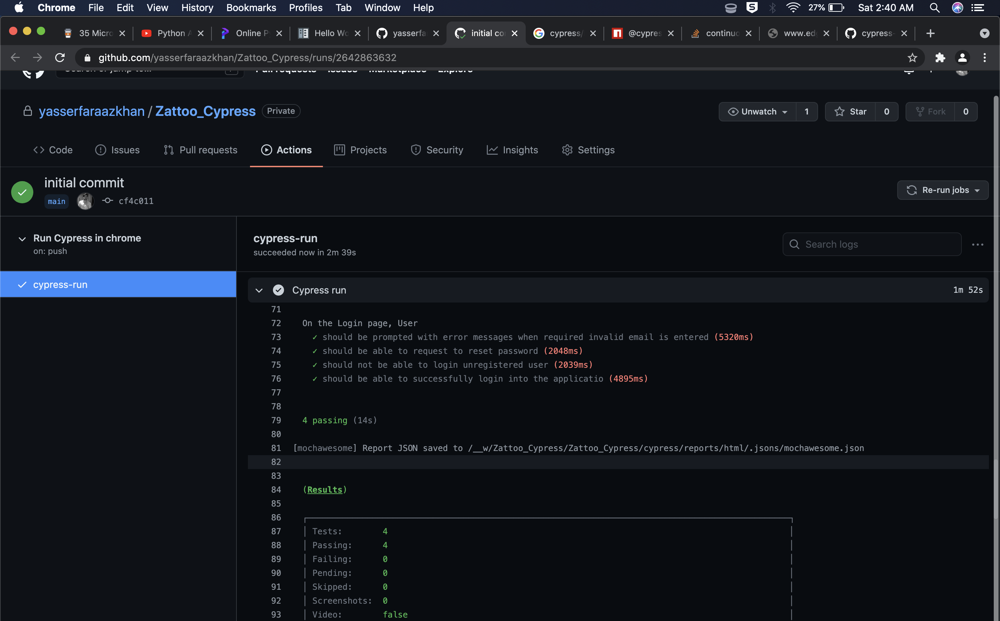

# Zattoo_Cypress

[](https://github.com/yasserfaraazkhan/Zattoo_Cypress/actions/workflows/main.yml)

## Installing

Install Dependencies [get started](https://docs.cypress.io/guides/getting-started/installing-cypress.html).

Requirements 

```bash
1. Node 14.15.0
2. NVM
3. Docker (to run it without any other Dependency Manually Configured)
4. Git
```

To run the project
```bash
git clone https://github.com/yasserfaraazkhan/Zattoo_Cypress.git
cd Zattoo_Cypress
nvm use
npm i
npm run test
```
# Cypress tests are split in two main categories:
    - Functional Tests

        - path: cypress/integration/functionalTests

        - run :
            1. Using Cypress UI - start cypress with `npm run cy-open` in Integration folder
                Choose a spec file from the folders presented in the tests list and run it
                Be aware that when using Cypress UI tests will be re-run once you modify code that affects the selected test file

            2. Command Line - node_modules/.bin/cypress run --spec 'path_to_spec_file'

    - Visual Tests

        - path: cypress/integration/visualTests

        - plugin used: cypress image snapshot plugin

        - Base images : images that needs to be updated once something changes in the UI (master snapshots)
            folder = TestReports/snapshots

        - Diff images : merge of 3 images - actual + diff + base
            folder = TestReports/snapshots/diff_output

        - run :
            1. Update base image snapshots -
            ```
            ./node_modules/.bin/cypress run --spec 'test/cypress/integration/visualTesting/**/*.js' --env updateSnapshots=true
            ```
            2. Test actual image snapshots - 
            ```
            ./node_modules/.bin/cypress run --spec 'test/cypress/integration/visualTesting/**/*.js' --env type=actual
            ```

    - Cypress Configuration File - cypress.json
        For debugging purpose chenge "numTestsKeptInMemory": 0 -> "numTestsKeptInMemory": 50
        Cypress will start recording all the states for all the steps performed during a run and once tests are finished
        you can see the exact state of a specific step. Very useful to see exactly the failures.

# Demo Run 


# CI

